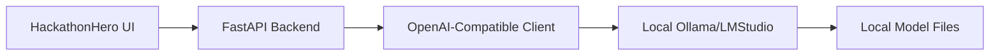

# Model Usage & Offline Explanation

## Overview

HackathonHero is designed as a **completely offline-first AI agent** that runs entirely on the user's local machine. This document explains how models are used, how offline functionality works, and the technical architecture that enables local-first operation.

## Model Usage Architecture

### Local LLM Runtime

HackathonHero uses **Ollama** or **LMStudio** as local LLM runtimes, providing complete offline inference capability:



**Key Components:**
- **Frontend**: React app with streaming SSE support
- **Backend**: FastAPI server handling API requests
- **LLM Client**: AsyncOpenAI client pointed to local runtime
- **Local Runtime**: Ollama or LMStudio serving models locally

### Supported Models

| Model | Size | Use Case | Offline Capability |
|-------|------|----------|-------------------|
| `gpt-oss:20b` | 20B parameters | Default model, good balance | ✅ Fully offline |
| `gpt-oss:120b` | 120B parameters | Higher quality responses | ✅ Fully offline |

### Model Selection & Switching

Users can switch models through the UI header:

```12:15:frontend/src/components/Header.jsx
<button
    onClick={() => setShowModelPicker(!showModelPicker)}
    className={`text-sm font-medium flex items-center glass-effect px-3 py-1 rounded-full transition-all duration-300 hover:scale-105 ${
        ollamaStatus.connected
            ? "text-green-600 text-readable-dark"
            : "text-red-600 text-readable-dark"
    }`}
    title="Click to change model"
    type="button"
>
```

**Features:**
- Real-time model status indication
- Dropdown selection of available models
- Provider switching (Ollama ↔ LMStudio)
- Persistent model preferences in SQLite

### Streaming Response Protocol

HackathonHero uses Server-Sent Events (SSE) for real-time streaming:

```typescript
// Event types sent from backend
type StreamEvent =
  | { type: 'session_info', session_id: string }
  | { type: 'rule_chunks', rule_chunks: string[] }
  | { type: 'thinking', content: string }
  | { type: 'tool_calls', tool_calls: ToolCall[] }
  | { type: 'token', token: string }
  | { type: 'end' }
```

**Streaming Flow:**
1. User submits message
2. Backend streams `session_info`
3. RAG retrieves relevant rule chunks
4. Model generates thinking tokens (if supported)
5. Tool calls are announced and executed
6. Response tokens stream in real-time
7. Stream ends with completion

## Offline-First Architecture

### Complete Local Operation

After initial setup, HackathonHero requires **zero network connectivity**:

```
┌─────────────────┐    ┌─────────────────┐    ┌─────────────────┐
│   Frontend      │    │   Backend       │    │   Local Models  │
│   (React)       │    │   (FastAPI)     │    │   (Ollama)      │
│                 │    │                 │    │                 │
│ • Chat UI       │    │ • API Routes    │    │ • gpt-oss:20b   │
│ • File Upload   │    │ • RAG System    │    │ • Embeddings    │
│ • Todo Manager  │    │ • SQLite DB     │    │ • No API calls  │
│ • Export System │    │ • Tool Calling  │    │                 │
└─────────────────┘    └─────────────────┘    └─────────────────┘
                                    │
                                    ▼
                         ┌─────────────────┐
                         │   Local Data    │
                         │   (SQLite)      │
                         │                 │
                         │ • Chat History  │
                         │ • Project       │
                         │ • Artifacts     │
                         │ • Settings      │
                         └─────────────────┘
```

### No External Dependencies

**After Setup:**
- ❌ No OpenAI API calls
- ❌ No cloud service dependencies
- ❌ No telemetry or data collection
- ❌ No internet connectivity required

### Data Persistence

All data is stored locally in SQLite:

```sql
-- Core tables for offline operation
CREATE TABLE chat_sessions (session_id, title, created_at, updated_at);
CREATE TABLE chat_messages (session_id, role, content, metadata, created_at);
CREATE TABLE project_artifacts (session_id, artifact_type, content, created_at);
CREATE TABLE todos (id, session_id, item, status, priority, created_at);
CREATE TABLE app_settings (key, value); -- Model preferences, etc.
```

### PWA Offline Capability

HackathonHero includes a Progressive Web App (PWA) shell:

```12:13:frontend/vite.config.js
workbox: {
    skipWaiting: true,
    clientsClaim: true,
    cleanupOutdatedCaches: true,
    globPatterns: ["**/*.{js,css,html,ico,png,svg}"],
    runtimeCaching: [
        {
            urlPattern: ({ request }) =>
                request.destination === "document" ||
                request.destination === "script" ||
                request.destination === "style" ||
                request.destination === "image" ||
                request.destination === "font",
            handler: "StaleWhileRevalidate",
            options: { cacheName: "app-shell" }
        }
    ]
}
```

## Setup Process

### Automated One-Click Setup

The setup scripts provide complete automation:

```bash
# MacOS (downloads and runs automatically)
curl -fsSL https://raw.githubusercontent.com/genggao/hackathon-agent/main/setup-macos.sh | bash
```

**What the script does:**
1. ✅ Install Python 3.11+, Node.js 22+, Tesseract OCR
2. ✅ Install and configure Ollama
3. ✅ Clone HackathonHero repository
4. ✅ Set up backend virtual environment
5. ✅ Set up frontend dependencies
6. ✅ Initialize SQLite database
7. ✅ **Auto-start Ollama service**
8. ✅ **Auto-download default model (gpt-oss:20b)**
9. ✅ **Auto-start backend server (http://localhost:8000)**
10. ✅ **Auto-start frontend server (http://localhost:5173)**
11. ✅ **Auto-open browser to HackathonHero**

### Manual Setup (Alternative)

For manual installation:

```bash
# 1. Install Ollama
brew install ollama  # MacOS
# OR download from https://ollama.com

# 2. Pull models
ollama pull gpt-oss:20b

# 3. Setup backend
cd backend
python -m venv .venv
source .venv/bin/activate
pip install -r requirements.txt
python -c "from models.db import init_db; init_db()"

# 4. Setup frontend
cd ../frontend
npm install

# 5. Start services
ollama serve &                    # Terminal 1
cd backend && uvicorn main:app &  # Terminal 2
cd frontend && npm run dev       # Terminal 3
```

## RAG (Retrieval Augmented Generation)

### Local Embedding System

HackathonHero uses completely local embeddings:

```python
# backend/rag.py
EMBED_MODEL = SentenceTransformer("all-MiniLM-L6-v2")  # 23MB model
DIM = EMBED_MODEL.get_sentence_embedding_dimension()  # 384 dimensions
```

**Embedding Pipeline:**
1. **Input Processing**: Text split into chunks by blank lines
2. **Local Embedding**: SentenceTransformer generates vectors locally
3. **Vector Storage**: FAISS index stores embeddings
4. **Similarity Search**: Cosine similarity finds relevant chunks
5. **Caching**: Embeddings cached to disk for warm starts

### Cache System

Embeddings are cached locally for performance:

```
backend/data/rag_cache/
└── <rules_hash>/
    ├── chunks.json
    ├── embeddings.npy
    ├── index.faiss
    └── metadata.json
```

**Benefits:**
- ⚡ Fast startup after initial indexing
- 💾 No recomputation on restart
- 🔄 Session-scoped context isolation

## Tool Calling System

### Local Function Execution

The LLM can call tools that execute locally:

```python
# Available tools (backend/tools/)
tools = {
    "get_session_id": Returns current session ID,
    "list_todos": Retrieve task list,
    "add_todo": Create new task,
    "clear_todos": Remove all tasks,
    "list_directory": Safe directory listing,
    "derive_project_idea": Generate project idea,
    "create_tech_stack": Generate tech recommendations,
    "summarize_chat_history": Create submission summary,
    "generate_chat_title": Auto-generate session title
}
```

**Execution Flow:**
1. LLM decides to call tool
2. Backend announces tool call via SSE
3. Tool executes locally (no network calls)
4. Results fed back to LLM
5. LLM continues with enriched context

## Performance Characteristics

### Model Performance

| Metric | gpt-oss:20b | gpt-oss:120b |
|--------|-------------|--------------|
| Model Size | ~40GB | ~240GB |
| RAM Usage | 8-16GB | 32-64GB |
| First Token | ~2-5s | ~5-10s |
| Tokens/sec | 10-20 | 15-25 |
| Quality | Good | Excellent |

### Offline Performance

**Warm Start:**
- Models already loaded in memory
- Embeddings cached on disk
- SQLite database ready
- PWA resources cached

**Cold Start:**
- Initial model download (~40GB for gpt-oss:20b)
- Embedding model download (~23MB)
- Database initialization
- Service worker cache population

## Security & Privacy

### Local-First Security

- 🔒 **No Data Transmission**: All processing stays on device
- 🛡️ **No External APIs**: Zero network calls during operation
- 🔐 **Local Storage Only**: SQLite database never leaves device
- 🚫 **No Telemetry**: No usage tracking or analytics
- 🔑 **No Accounts**: No user registration or authentication required

### File Processing Security

```python
# backend/api/common.py - Safe file handling
def extract_text_from_file(file: UploadFile) -> str:
    # Size limits
    MAX_FILE_SIZE = 10 * 1024 * 1024  # 10MB

    # Type validation
    allowed_types = {
        'text/plain', 'application/pdf',
        'application/vnd.openxmlformats-officedocument.wordprocessingml.document',
        'image/png', 'image/jpeg', 'image/jpg'
    }
```

## Cross-Platform Compatibility

### Supported Platforms

| Platform | Status | Setup Method |
|----------|--------|--------------|
| macOS | ✅ Full Support | Automated script |
| Linux | ✅ Full Support | Automated script |
| Windows | ✅ Full Support | PowerShell script |

### System Requirements

**Minimum Requirements:**
- **CPU**: 4+ cores recommended
- **RAM**: 16GB (gpt-oss:20b), 64GB (gpt-oss:120b)
- **Storage**: 50GB free space
- **OS**: macOS 10.15+, Ubuntu 18.04+, Windows 10+

**Recommended:**
- **CPU**: 8+ cores
- **RAM**: 32GB+
- **Storage**: SSD with 100GB+ free
- **GPU**: Optional (Ollama can use GPU acceleration)

## Troubleshooting

### Common Issues

**Model Download Fails:**
```bash
# Check Ollama status
ollama list
# Restart Ollama
ollama serve
# Retry download
ollama pull gpt-oss:20b
```

**Out of Memory:**
```bash
# Switch to smaller model
ollama pull gpt-oss:7b  # If available
# Or increase system RAM
```

**Slow Performance:**
- Use SSD storage
- Ensure adequate RAM
- Close other memory-intensive applications
- Consider using GPU acceleration with Ollama

### Debugging

Enable debug logging:
```bash
# Backend debug
export DEBUG_STREAM=1
cd backend && uvicorn main:app --reload

# Frontend debug
cd frontend && npm run dev -- --mode development
```

## Future Enhancements

### Planned Offline Improvements

- **Model Optimization**: Quantized models for lower resource usage
- **Incremental Indexing**: Faster RAG updates for large documents
- **Model Switching**: Seamless switching without restart
- **Custom Models**: Support for fine-tuned local models
- **Multi-Modal**: Local image understanding capabilities

---

**Bottom Line**: HackathonHero is designed to be completely self-contained after setup, providing professional-grade AI assistance without any external dependencies or data leaving your device.
